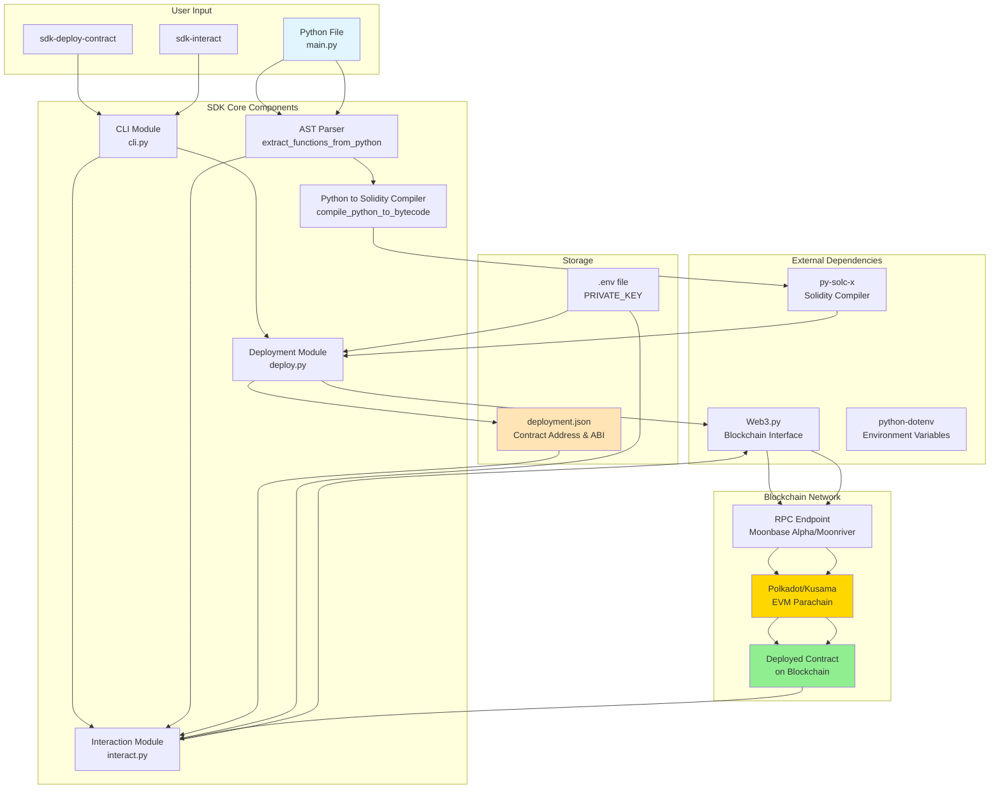

# Polkadot Contract SDK

## 📋 Project Overview

**Project Name:** polkadot-contract-sdk

**Tagline:** Write your smart contracts in Python and deploy them directly to Polkadot EVM compatible chains.

**Description:**

The Polkadot Contract SDK is a revolutionary tool that allows developers to write smart contracts in Python and deploy them directly to Polkadot/Kusama EVM-compatible parachains (like Moonbase Alpha and Moonriver). 

**Problem it solves:**
- Traditional smart contract development requires learning Solidity, which has a steep learning curve
- Developers familiar with Python face barriers when entering the blockchain space
- The abstraction between high-level code and blockchain deployment is complex

**What makes it unique:**
- **Python-First Approach**: Write contracts in Python - no Solidity knowledge required
- **Zero Abstraction Leakage**: Solidity is used internally but completely hidden from users
- **Interactive CLI**: Simple command-line interface for deployment and interaction
- **Function Discovery**: Automatically discovers functions from your Python code
- **Seamless Integration**: Works with any EVM-compatible Polkadot parachain

## 👥 Team Information

**Team Name:** Omkar Ghongade

**Team Members:**
- Omkar Ghongade (https://github.com/omkar-ghongade) - Developer & Creator

## 🛠️ Technologies Used

- **Language:** Python 3.8+
- **Blockchain:** Polkadot/Kusama EVM Parachains (Moonbase Alpha, Moonriver)
- **Smart Contracts:** Python → Solidity (internal) → EVM Bytecode
- **Core Libraries:**
  - **Web3.py** (v6.0.0+): Blockchain interaction and transaction management
  - **py-solc-x** (v1.1.1+): Solidity compiler wrapper for EVM bytecode generation
  - **python-dotenv** (v1.0.0+): Environment variable management
  - **Python AST**: Source code parsing and function extraction
- **Networks:** Moonbase Alpha (Testnet), Moonriver (Kusama), Any EVM-compatible chain

## 🏗️ Architecture

The SDK architecture consists of two main flows: **Deployment** and **Interaction**. The system abstracts away Solidity completely, allowing developers to work exclusively in Python.



### Key Components

1. **AST Parser**: Extracts function signatures and source code from Python files using Python's built-in AST module
2. **Python-to-Solidity Compiler**: Converts Python functions to Solidity code in-memory (never saved to disk)
3. **Deployment Module**: Handles contract compilation, gas estimation, and blockchain deployment
4. **Interaction Module**: Provides interactive CLI menu for calling contract functions
5. **CLI Module**: Command-line entry points for deployment and interaction

### Deployment Flow

```
Python File → AST Parser → Solidity Compiler (in-memory) → EVM Bytecode → 
Web3.py → Blockchain → deployment.json
```

### Interaction Flow

```
sdk-interact → Load deployment.json → Read Python file → Build menu → 
User input → Web3.py → Blockchain → Display results
```

For detailed architecture documentation, see [sdk/ARCHITECTURE.md](sdk/ARCHITECTURE.md)

## 🚀 Getting Started

### Prerequisites

- Python 3.8 or higher
- pip (Python package manager)
- A Polkadot/Kusama EVM-compatible wallet with testnet tokens (for Moonbase Alpha)

### Installation

```bash
# Install the SDK from PyPI
pip install polkadot-contract-sdk

# Or install from source
git clone <your-repo-url>
cd submissions/polkadot-contract-sdk/sdk
pip install -e .
```

### Configuration

Set your private key as an environment variable:

```bash
# Option 1: Export as environment variable
export PRIVATE_KEY='your_private_key_here'

# Option 2: Create a .env file
echo "PRIVATE_KEY=your_private_key_here" > .env
```

**⚠️ Security Note**: Never commit your private key to version control. Always use environment variables or `.env` files (which should be in `.gitignore`).

### Quick Start Example

1. **Create a Python contract** (`main.py`):

```python
def multiply_numbers(a, b):
    return a * b

def add_numbers(a, b):
    return a + b

def main():
    print(multiply_numbers(2, 3))
    print(add_numbers(5, 7))

if __name__ == "__main__":
    main()
```

2. **Deploy the contract**:

```bash
sdk-deploy-contract main.py
```

3. **Interact with the deployed contract**:

```bash
sdk-interact
```

The SDK will show an interactive menu with your Python functions. Select a function, provide parameters, and execute!

### Getting Testnet Tokens

For Moonbase Alpha testnet, get free tokens from:
- **Faucet**: https://faucet.moonbeam.network/

## 📱 Features

- ✅ **Python-First Development**: Write smart contracts in Python - no Solidity required
- ✅ **Automatic Function Discovery**: SDK automatically discovers functions from your Python code
- ✅ **Interactive CLI**: Menu-driven interface for easy contract interaction
- ✅ **Multi-Network Support**: Works with Moonbase Alpha, Moonriver, and any EVM-compatible chain
- ✅ **Zero Configuration**: Simple setup with just a private key
- ✅ **Deployment Metadata**: Automatic saving of contract addresses and ABIs
- ✅ **Gas Estimation**: Automatic gas estimation before deployment
- ✅ **Transaction Management**: Handles nonce management and transaction signing
- ✅ **Error Handling**: Comprehensive error messages and validation

## 🎯 Use Cases

1. **Python Developers Entering Web3**: Lower the barrier for Python developers to build on blockchain
2. **Rapid Prototyping**: Quickly test smart contract ideas without learning Solidity
3. **Educational Purposes**: Teach blockchain concepts using familiar Python syntax
4. **Simple Calculations & Logic**: Deploy mathematical operations, calculators, and simple business logic
5. **Cross-Chain Development**: Deploy to multiple Polkadot parachains with the same Python code
6. **Proof of Concept**: Quickly validate smart contract concepts before full Solidity implementation

## 🔗 Links & Resources

- **SDK Documentation**: See [sdk/README.md](sdk/README.md) for detailed usage
- **Architecture Details**: See [sdk/ARCHITECTURE.md](sdk/ARCHITECTURE.md) for system design
- **Quick Start Guide**: See [sdk/QUICKSTART.md](sdk/QUICKSTART.md)
- **Installation Guide**: See [sdk/INSTALL.md](sdk/INSTALL.md)
- **PyPI Package**: `polkadot-contract-sdk` (when published)
- **Network Faucets**:
  - Moonbase Alpha: https://faucet.moonbeam.network/
- **RPC Endpoints**:
  - Moonbase Alpha: `https://rpc.api.moonbase.moonbeam.network`
  - Moonriver: `https://rpc.api.moonriver.moonbeam.network`

## 📸 Screenshots

### Deployment Example

```bash
$ sdk-deploy-contract main.py
============================================================
🐍 Deploy Python File as Smart Contract
============================================================

📖 Reading main.py...
✅ Found 2 function(s) in main.py
🔨 Compiling to blockchain bytecode...
✅ Python compiled successfully!

🌐 Connecting to network...
✅ Connected! Chain ID: 1287

🔑 Account setup:
   Address: 0x...
   Balance: 1.5 DEV

============================================================
📦 Compiling to blockchain bytecode...
✅ Compiled to blockchain bytecode!
📄 Compiled size: 1234 bytes
🚀 Deploying to Moonbase Alpha...
⏳ Transaction hash: 0x...
✅ Contract deployed at: 0x...
============================================================
✅ Deployment complete!
============================================================
```

### Interaction Example

```bash
$ sdk-interact
============================================================
🔌 Smart Contract Interaction
============================================================

📖 Reading main.py to discover functions...
✅ Found 2 function(s) from main.py:
   - multiply_numbers
   - add_numbers

✅ Connected to network
📍 Contract Address: 0x...

------------------------------------------------------------
Available actions (from Python file):
1. Call multiply_numbers(a, b)
2. Call add_numbers(a, b)
3. Get last result
4. Get calculation count
5. Exit
------------------------------------------------------------

Select an action (1-5): 1
Enter a: 5
Enter b: 3

📤 Calling multiply_numbers(5, 3)...
⏳ Transaction hash: 0x...
✅ Transaction confirmed!
📊 Result: 15
```

## 🧪 Testing

The SDK has been tested on:
- Moonbase Alpha testnet (primary testing environment)
- Various Python function types (arithmetic operations, calculations)
- Multiple deployment scenarios
- Contract interaction flows

### Manual Testing Steps

1. **Deploy a contract**:
   ```bash
   sdk-deploy-contract main.py
   ```

2. **Verify deployment**:
   - Check `deployment.json` for contract address
   - Verify transaction on block explorer (Moonbase Alpha)

3. **Interact with contract**:
   ```bash
   sdk-interact
   ```

4. **Test functions**:
   - Call each function with different parameters
   - Verify results match expected outputs

## 🚧 Challenges & Solutions

### Challenge 1: Python to Blockchain Compilation
**Problem**: EVM requires Solidity bytecode, but we want users to write Python.

**Solution**: 
- Use Python AST to parse functions
- Generate Solidity code in-memory (never saved to disk)
- Compile Solidity to EVM bytecode using py-solc-x
- Complete abstraction - users never see Solidity

### Challenge 2: Function Discovery for Interaction
**Problem**: Need to know available functions when interacting with deployed contracts.

**Solution**:
- Read original Python file during interaction
- Use AST parser to discover function signatures
- Build dynamic menu based on discovered functions
- Maintain Python syntax throughout the workflow

### Challenge 3: Transaction Management
**Problem**: Handle nonce management, gas estimation, and transaction signing correctly.

**Solution**:
- Implement proper nonce fetching (with 'pending' state)
- Add gas estimation with 20% buffer
- Use Web3.py for transaction signing and sending
- Comprehensive error handling for insufficient funds

### Challenge 4: Network Compatibility
**Problem**: Support multiple Polkadot parachains with different configurations.

**Solution**:
- Default to Moonbase Alpha (testnet)
- Allow custom RPC URLs via CLI flags
- Store network info in deployment.json
- Support any EVM-compatible chain

## 🔮 Future Improvements

- [ ] **Extended Python Support**: Support more Python operations (loops, conditionals, data structures)
- [ ] **Type System**: Add Python type hints and convert to Solidity types
- [ ] **Testing Framework**: Built-in testing utilities for contract testing
- [ ] **Contract Upgradability**: Support for upgradeable contracts
- [ ] **Event Handling**: Better support for contract events and logs
- [ ] **Multi-File Support**: Import and compile multiple Python files
- [ ] **Advanced Operations**: Support for arrays, mappings, and complex data structures
- [ ] **Gas Optimization**: Automatic gas optimization suggestions
- [ ] **Contract Verification**: Automatic contract verification on block explorers
- [ ] **Web Interface**: Browser-based UI for deployment and interaction
- [ ] **Package Manager**: Share and reuse Python contract templates
- [ ] **Debugging Tools**: Better error messages and debugging capabilities

## 📄 License

MIT License - see [sdk/LICENSE](sdk/LICENSE) for details

## 🙏 Acknowledgments

- **Web3.py**: For excellent blockchain interaction capabilities
- **py-solc-x**: For Solidity compilation support
- **Polkadot/Kusama**: For the amazing EVM-compatible parachain infrastructure
- **Moonbeam Network**: For Moonbase Alpha testnet and excellent documentation
- **Python Community**: For the powerful AST module and ecosystem

---

**Built for Stellar x Polkadot Hackerhouse BLR** 🎉