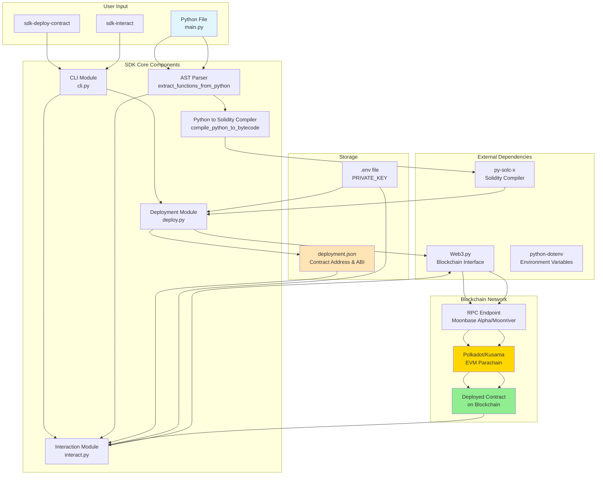

# Polkadot Smart Contract SDK - Architecture Diagram

This document provides a detailed architecture overview of how the SDK works.

## System Architecture



## Detailed Component Breakdown

### 1. CLI Entry Points

**Location**: `polkadot_contract_sdk/cli.py`

- `sdk-deploy-contract`: Entry point for deployment command
- `sdk-interact`: Entry point for interaction command
- Handles command-line argument parsing and routing

### 2. AST Parser

**Location**: `polkadot_contract_sdk/deploy.py` and `polkadot_contract_sdk/interact.py`

- Uses Python's `ast` module to parse Python source code
- Extracts function definitions, arguments, and source code
- Function: `extract_functions_from_python(file_path)`

### 3. Python-to-Solidity Compiler

**Location**: `polkadot_contract_sdk/deploy.py`

- Analyzes Python function bodies to detect operations (+, -, *, /)
- Generates Solidity contract code in-memory (never saved to disk)
- Function: `compile_python_to_bytecode(python_functions)`
- **Note**: Solidity is used internally as an intermediate representation, but users only write Python

### 4. Deployment Module

**Location**: `polkadot_contract_sdk/deploy.py`

**Process**:
1. Reads Python file
2. Extracts functions using AST parser
3. Compiles to Solidity (in-memory)
4. Compiles Solidity to EVM bytecode using `py-solc-x`
5. Connects to blockchain via Web3.py
6. Deploys contract as a transaction
7. Saves deployment info to `deployment.json`

**Key Functions**:
- `deploy(python_file_path, output_file, rpc_url)`: Main deployment function
- `deploy_contract(web3, account, python_bytecode)`: Handles actual deployment

### 5. Interaction Module

**Location**: `polkadot_contract_sdk/interact.py`

**Process**:
1. Loads contract address and ABI from `deployment.json`
2. Reads original Python file to discover functions
3. Builds interactive menu based on Python functions
4. Allows user to call functions with parameters
5. Sends transactions via Web3.py
6. Displays results

**Key Functions**:
- `interact(contract_address, python_file_path, deployment_file, rpc_url)`: Main interaction function
- `load_deployment(deployment_file)`: Loads deployment information

### 6. External Dependencies

#### Web3.py
- Blockchain interaction library
- Handles RPC communication
- Manages transactions and contract calls

#### py-solc-x
- Solidity compiler wrapper
- Compiles Solidity code to EVM bytecode
- Used internally (users never see Solidity code)

#### python-dotenv
- Loads environment variables from `.env` file
- Used for `PRIVATE_KEY` management

## Data Flow

### Deployment Flow

```
Python File (main.py)
    ↓
AST Parser (extract functions)
    ↓
Python-to-Solidity Compiler (generate Solidity in-memory)
    ↓
py-solc-x (compile to EVM bytecode)
    ↓
Web3.py (deploy transaction)
    ↓
Blockchain (contract deployed)
    ↓
deployment.json (save address & ABI)
```

### Interaction Flow

```
sdk-interact command
    ↓
Load deployment.json (get address & ABI)
    ↓
Read Python file (discover functions)
    ↓
Build interactive menu
    ↓
User selects function & provides parameters
    ↓
Web3.py (send transaction)
    ↓
Blockchain (execute contract function)
    ↓
Display result
```

## File Structure

```
polkadot_contract_sdk/
├── __init__.py          # Package initialization
├── cli.py               # CLI entry points
├── deploy.py            # Deployment logic
└── interact.py          # Interaction logic
```

## Environment Variables

- `PRIVATE_KEY`: Private key for signing transactions
- Can be set via:
  - Environment variable: `export PRIVATE_KEY='...'`
  - `.env` file: `PRIVATE_KEY=...`

## Network Configuration

**Default RPC Endpoints**:
- Moonbase Alpha (Testnet): `https://rpc.api.moonbase.moonbeam.network`
- Moonriver (Kusama): `https://rpc.api.moonriver.moonbeam.network`
- Custom RPC: Can be specified via `-r` flag

## Key Design Decisions

1. **Python-First Approach**: Users only write Python code; Solidity is completely abstracted away
2. **In-Memory Compilation**: Solidity code is never saved to disk, keeping the abstraction clean
3. **Function Discovery**: Original Python file is used for interaction to maintain Python syntax
4. **Deployment Metadata**: `deployment.json` stores contract address and ABI for easy interaction
5. **Interactive CLI**: Menu-driven interface for contract interaction

## Security Considerations

- Private keys are loaded from environment variables (never hardcoded)
- Transactions are signed locally before sending
- Gas estimation is performed before deployment
- Nonce management ensures transaction ordering

