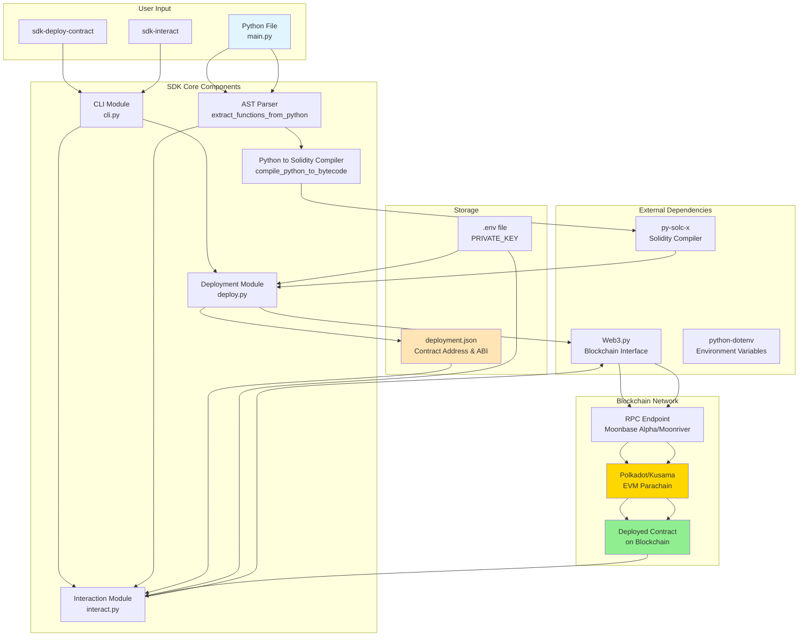

# Polkadot Smart Contract SDK

A simple SDK for deploying and interacting with smart contracts on Polkadot/Kusama networks. Write Python code and deploy it directly to the blockchain!

## Installation

```bash
pip install polkadot-contract-sdk
```

## Quick Start

### 1. Deploy a Contract

Create a Python file `main.py`:

```python
def multiply_numbers(a, b):
    return a * b

def main():
    print(multiply_numbers(2, 3))

if __name__ == "__main__":
    main()
```

Deploy it:

```bash
sdk-deploy-contract main.py
```

### 2. Interact with a Contract

```bash
# Use contract address from deployment.json
sdk-interact

# Or specify contract address directly
sdk-interact 0x1234567890123456789012345678901234567890
```

## Setup

Set your private key as an environment variable:

```bash
export PRIVATE_KEY='your_private_key_here'
```

Or create a `.env` file:

```
PRIVATE_KEY=your_private_key_here
```

## Commands

### sdk-deploy-contract

Deploy a Python file as a smart contract.

```bash
sdk-deploy-contract <python-file> [options]
```

**Options:**
- `-o, --output`: Output file for deployment information (default: `deployment.json`)
- `-r, --rpc`: Custom RPC URL (default: Moonbase Alpha testnet)

**Example:**
```bash
sdk-deploy-contract main.py -o my_deployment.json
```

### sdk-interact

Interact with a deployed smart contract.

```bash
sdk-interact [contract-address] [options]
```

**Options:**
- `-p, --python-file`: Path to original Python file (default: `main.py`)
- `-d, --deployment`: Path to deployment.json (default: `deployment.json`)
- `-r, --rpc`: Custom RPC URL (default: Moonbase Alpha testnet)

**Examples:**
```bash
# Load from deployment.json
sdk-interact

# Use specific contract address
sdk-interact 0x1234567890123456789012345678901234567890

# Custom files
sdk-interact -p my_contract.py -d my_deployment.json
```

## Architecture

The SDK architecture consists of two main flows: **Deployment** and **Interaction**. Here's how it works:



### Deployment Flow

1. **User Input**: User writes Python code (`main.py`) with functions
2. **CLI Command**: User runs `sdk-deploy-contract main.py`
3. **AST Parsing**: SDK uses Python's AST module to extract function definitions
4. **Compilation**: 
   - Functions are analyzed and converted to Solidity code (in-memory only)
   - Solidity code is compiled to EVM bytecode using `py-solc-x`
5. **Deployment**:
   - SDK connects to blockchain via Web3.py using RPC endpoint
   - Contract is deployed as a transaction
   - Contract address and ABI are saved to `deployment.json`
6. **Result**: Smart contract is live on the blockchain

### Interaction Flow

1. **CLI Command**: User runs `sdk-interact`
2. **Function Discovery**: SDK reads original Python file to discover available functions
3. **Contract Loading**: SDK loads contract address and ABI from `deployment.json`
4. **Interactive Menu**: SDK builds a dynamic menu based on Python functions
5. **Function Execution**:
   - User selects function and provides parameters
   - SDK constructs transaction via Web3.py
   - Transaction is signed and sent to blockchain
   - Results are retrieved and displayed
6. **Result**: User can interact with deployed contract using Python function names

### Key Components

- **AST Parser**: Extracts function signatures and source code from Python files
- **Python-to-Solidity Compiler**: Converts Python functions to Solidity (internal, hidden from user)
- **Deployment Module**: Handles contract compilation and deployment
- **Interaction Module**: Provides interactive interface for calling contract functions
- **CLI Module**: Command-line interface entry points

## How It Works

1. **Deployment**: The SDK reads your Python file, extracts functions, and compiles them to blockchain bytecode. Internally, it uses Solidity as an intermediate step, but you only write Python code.

2. **Interaction**: The SDK reads your original Python file to discover available functions and provides an interactive menu to call them on the deployed contract.

## Requirements

- Python 3.8+
- web3>=6.0.0
- py-solc-x>=1.1.1
- python-dotenv>=1.0.0

## Network Support

- **Moonbase Alpha** (Testnet) - Default
- **Moonriver** (Kusama Parachain)
- Any EVM-compatible network via custom RPC URL

## Getting Testnet Tokens

For Moonbase Alpha testnet, get free tokens from:
https://faucet.moonbeam.network/

## License

MIT License - see LICENSE file for details

## Contributing

Contributions are welcome! Please feel free to submit a Pull Request.

## Support

For issues and questions, please open an issue on GitHub.

